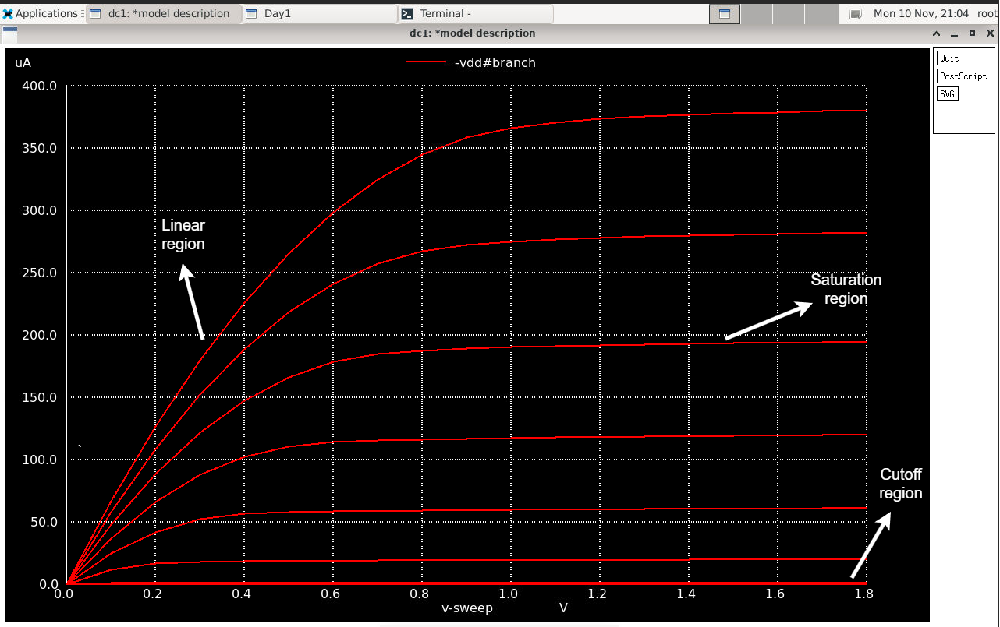
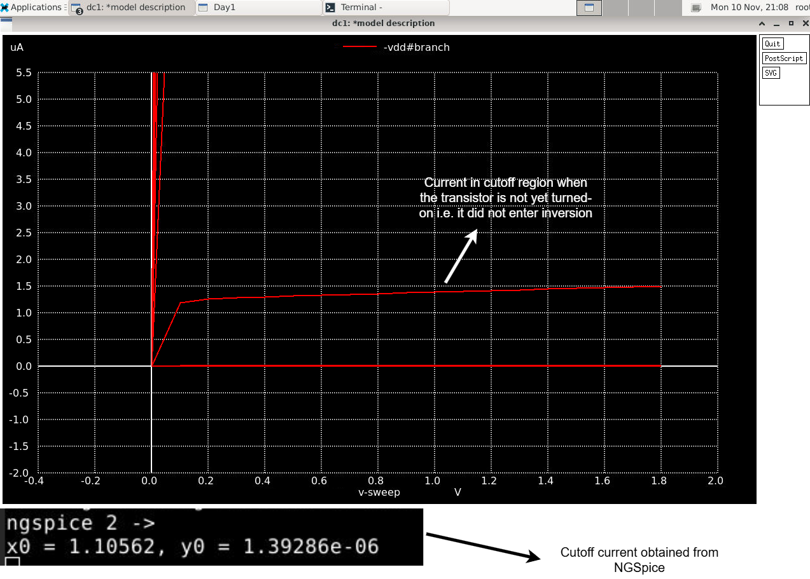

# Day 1 Lab Sims

### Objective
Obtain Id vs Vds curve of a NMOS 

### Spice Netlist
[Day1 NFET Id vs Vds Netlist](./day1_nfet_idvds_L2_W5.spice)

### Results & Inferences

|  |
|:----------------------:|
| *Figure 1: Id vs Vds of an NFET.* |

|  |
|:----------------------:|
| *Figure 2: Zoom into the cutoff region of Id vs Vds.* |

* The three regions of the Id vs Vds curve of an FET have been identified. 

