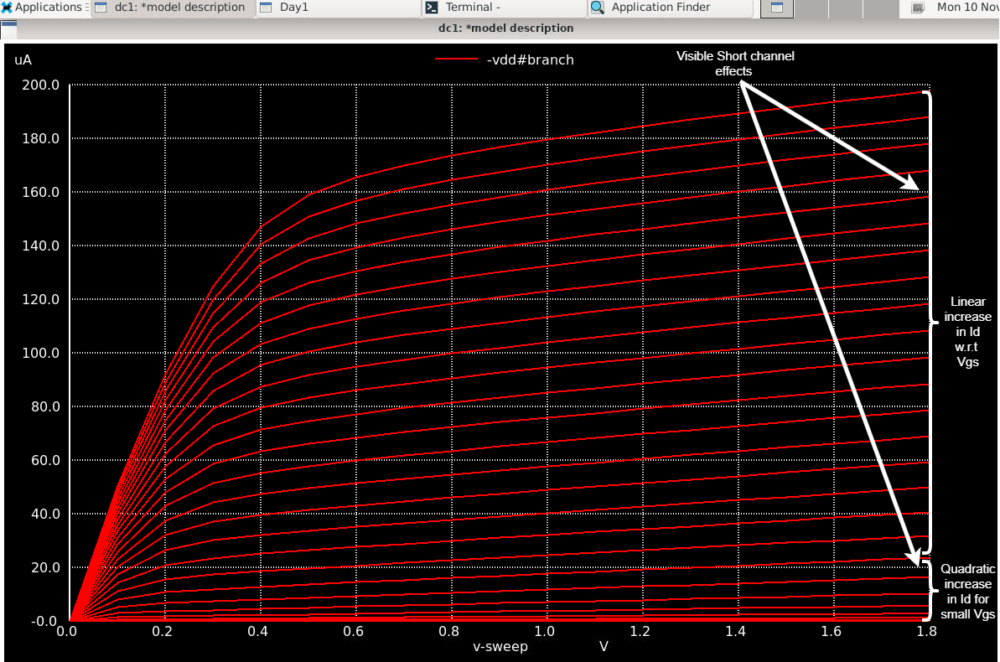
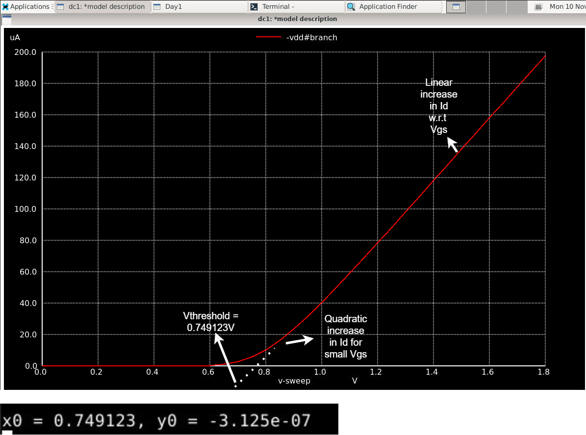

# Day 2 Lab Sims

### Objective
Obtain Id vs Vds and Id vs Vgs curves of a short channel NMOS 

### Spice Netlist
[Day2 NFET Id vs Vds Netlist](./day2_nfet_idvds_L015_W039.spice)
[Day2 NFET Id vs Vgs Netlist](./day2_nfet_idvgs_L015_W039.spice)

### Results & Inferences

|  |
|:----------------------:|
| *Figure 1: Id vs Vds of a short channel NFET.* |

|  |
|:----------------------:|
| *Figure 2: Id vs Vgs of a short channel NFET.* |

* As pointed out in both the waveforms, we can see a quadratic relationship between Id vs Vgs when Vgs is small and a linear relationship when Vgs is large. This is due to velocity saturation of the carriers. With a constant (saturated) velocity after Vds > Vdsat, Id does not increase quadractically since Id is only directly propertional to Vgs now and not sqaure of Vgs.

* From the Id vs Vgs curve, the threshold voltage can be extracted by estimating the x-axis intercept as shown above.
