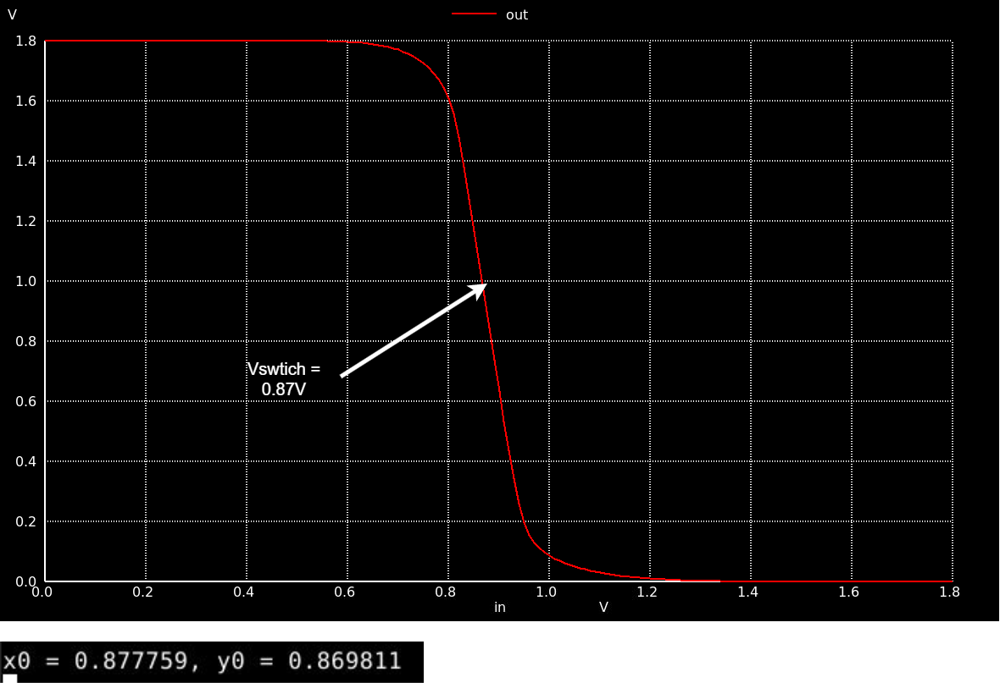
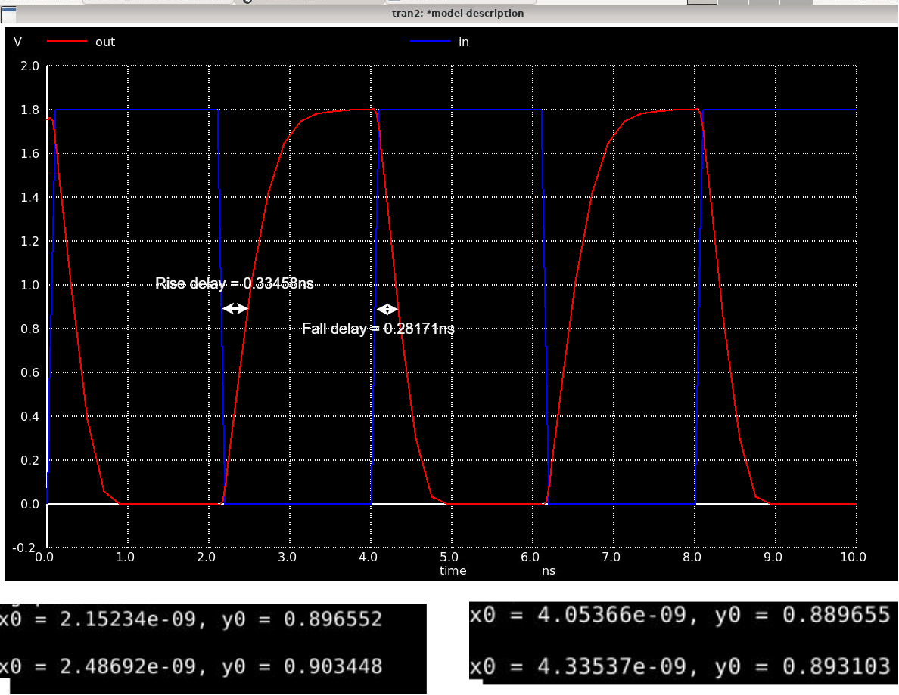

# Day 3 Lab Sims

### Objective
Obtain Vout vs Vin (VTC) and Trainsiant characteristics of a CMOS inverter 

### Spice Netlist
[Day3 CMOS Inv Vout vs Vin Netlist](./day3_inv_vtc_Wp084_Wn036.spice)
[Day3 CMOS Transiant Characteristics Netlist](./day3_inv_tran_Wp084_Wn036.spice)

### Results & Inferences

|  |
|:----------------------:|
| *Figure 1: Vout vs Vin of a CMOS inverter.* |

|  |
|:----------------------:|
| *Figure 2: Vout and Vin Transiant responce w.r.t time of a CMOS inverter.* |

* The switching voltage of the CMOS inverter is found to be 0.87V as shown above. 

* The rise and fall delay of the CMOS inverter is found to be 0.33458ns and 0.28171ns respectively.
