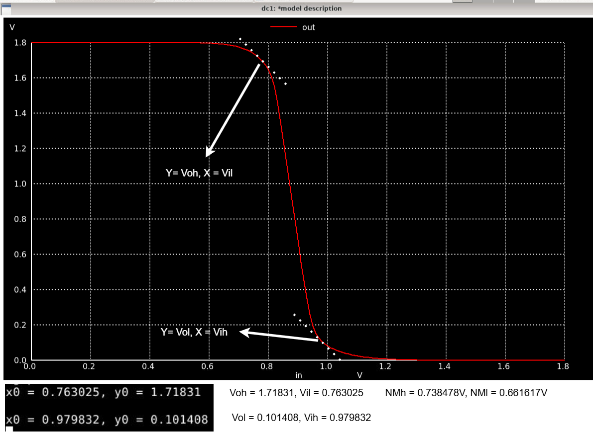

# Day 4 Lab Sims

### Objective
Obtain noise margins from Vout vs Vin (VTC) curve of a CMOS inverter 

### Spice Netlist
[Day4 CMOS Inv Vout vs Vin Netlist](./day4_inv_noisemargin_wp1_wn036.spice)

### Results & Inferences

|  |
|:----------------------:|
| *Figure 1: Vout vs Vin of a CMOS inverter.* |

* As seen above, points at which the slope is apporximately 45/135 degrees are first extracted from the VTC curve. The noise margins are thus calculated as shown above.

 