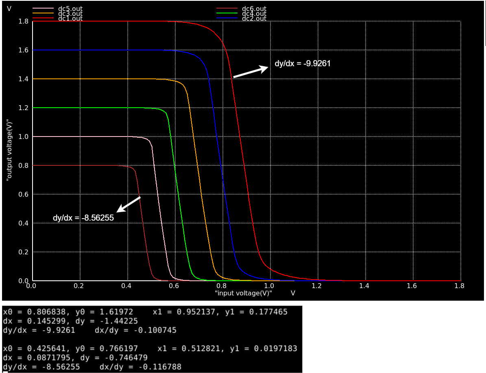
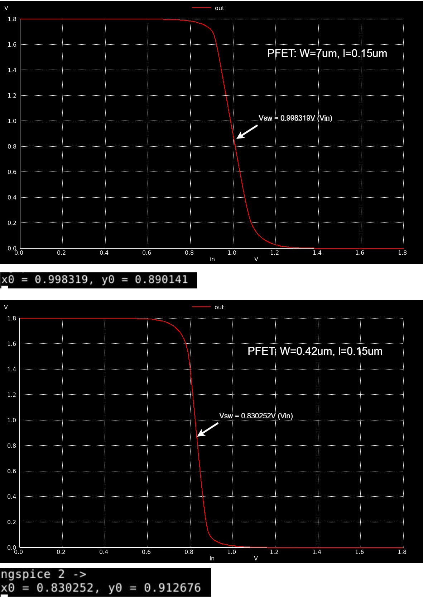

# Day 5 Lab Sims

### Objective
Simulate power supply and device variations in a CMOS inverter

### Spice Netlist
[Day5 CMOS supply voltage variation Netlist](./day5_inv_supplyvariation_Wp1_Wn036.spice)
[Day5 CMOS device variation Netlist](./day5_inv_devicevariation_wp7_wn042.spice)

### Results & Inferences

|  |
|:----------------------:|
| *Figure 1: Vout vs Vin of a CMOS inverter for various Vdd values(supply voltages).* |

|  |
|:----------------------:|
| *Figure 2: Vout vs Vin of a CMOS inverter for two different PFET widths.* |

* With the reduction in the power supply, the switching threshold and gain can be seen reducing. However, the gain itself is still high and the VTC curve maintains its shape i.e. the switching threshold is still close to Vdd/2. The CMOS inverter is therefore robust under supply voltage variations.

* With the drastic reduction in the width of the PFET from 7um to 0.42um i.e. 16 times reduction we only see a change of 168.067mV. Therefore it can infered that the CMOS inverter is also robust under device dimension variations.

 